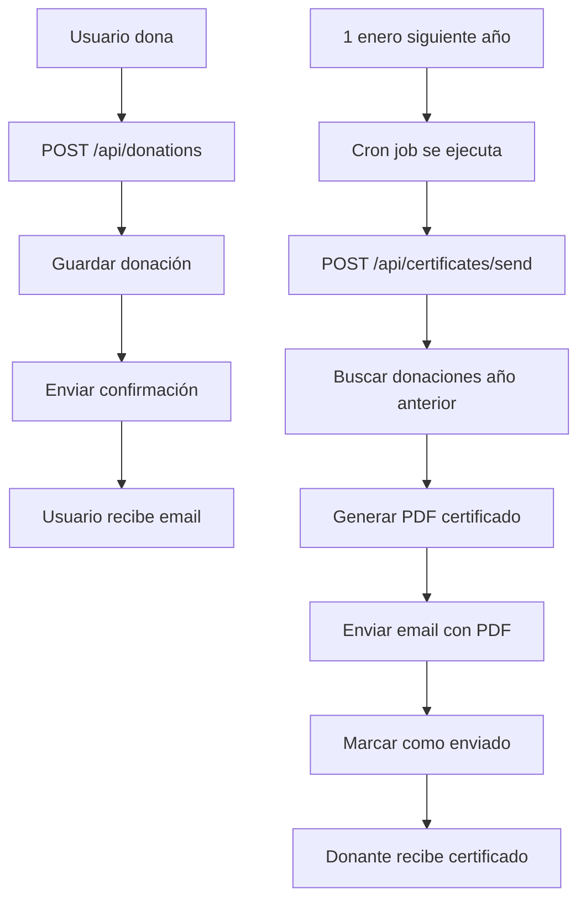

# Sistema de Certificados de Donación

Este documento explica cómo funciona el sistema de envío automático de certificados de donación de la Fundación Huahuacuna.

## 🎯 Funcionalidad

El sistema permite:
- Registrar donaciones monetarias y en especie
- Generar certificados PDF personalizados con los datos del donante
- Enviar automáticamente los certificados por email el 1 de enero del año siguiente a la donación
- Programar el envío mediante cron jobs

## 📋 Requisitos

### Dependencias instaladas:
```bash
npm install nodemailer pdf-lib @types/nodemailer node-cron
```

### Variables de entorno (.env.local):
```env
# Configuración de email (SMTP)
SMTP_HOST=smtp.gmail.com
SMTP_PORT=587
SMTP_USER=tu-email@gmail.com
SMTP_PASSWORD=tu-contraseña-de-aplicacion
```

## 🔧 Configuración

### 1. Configurar Gmail para envío de emails

Si usas Gmail:
1. Ir a tu cuenta de Google
2. Habilitar la verificación en dos pasos
3. Crear una "Contraseña de aplicación" específica
4. Usar esa contraseña en `SMTP_PASSWORD`

### 2. Alternativas para desarrollo (Mailtrap)

Para pruebas sin usar email real:
```env
SMTP_HOST=smtp.mailtrap.io
SMTP_PORT=2525
SMTP_USER=tu-usuario-mailtrap
SMTP_PASSWORD=tu-password-mailtrap
```

## 📂 Estructura de archivos

```
src/
├── types/
│   └── donation.ts              # Tipos TypeScript para donaciones
├── lib/
│   ├── certificateGenerator.ts  # Genera PDFs personalizados
│   ├── emailService.ts          # Servicio de envío de emails
│   ├── donationStorage.ts       # Almacenamiento de donaciones
│   └── cronJobs.ts              # Tareas programadas
├── app/
│   ├── api/
│   │   ├── donations/
│   │   │   └── route.ts         # API para registrar donaciones
│   │   └── certificates/
│   │       └── send/
│   │           └── route.ts     # API para enviar certificados
│   └── donaciones/
│       └── page.tsx             # Página de donaciones
└── data/
    └── donations.json           # Almacén de donaciones (temporal)
```

## 🚀 Uso

### Registrar una donación

El usuario completa el formulario en `/donaciones`. Los datos se envían a:
```
POST /api/donations
```

Datos requeridos:
```json
{
  "donorName": "Juan Pérez",
  "donorEmail": "juan@example.com",
  "donorPhone": "1234567890",
  "donationType": "monetaria",  // o "especie"
  "amount": 50000,              // solo para monetaria
  "inKindDescription": "..."    // solo para especie
}
```

### Envío automático de certificados

El sistema está configurado para enviar certificados el 1 de enero de cada año a las 9:00 AM (zona horaria de Colombia).

#### Cron job en producción:
```typescript
// Se ejecuta el 1 de enero a las 9:00 AM
cron.schedule('0 9 1 1 *', sendCertificatesJob, {
  scheduled: true,
  timezone: 'America/Bogota'
});
```

#### Para pruebas (ejecutar cada minuto):
```typescript
// En src/lib/cronJobs.ts, usa:
initializeCertificateCronJobDev();
```

### Envío manual de certificados

Puedes enviar certificados manualmente mediante:
```
POST /api/certificates/send
```

Este endpoint:
1. Busca todas las donaciones del año anterior sin certificado enviado
2. Genera y envía el certificado por email
3. Marca la donación como "certificado enviado"

### Verificar certificados pendientes

```
GET /api/certificates/send
```

Respuesta:
```json
{
  "pendingCertificates": 5,
  "donations": [...]
}
```

## 📧 Email enviado

El email incluye:
- Mensaje de agradecimiento personalizado
- Detalles de la donación (tipo, monto, fecha)
- Certificado PDF adjunto con:
  - Nombre del donante
  - Tipo y monto/descripción de la donación
  - Fecha de donación
  - Número de certificado único
  - Fecha de emisión

## 🎨 Personalización del PDF

Para personalizar el certificado, edita `src/lib/certificateGenerator.ts`:

```typescript
// Ajustar posiciones del texto
firstPage.drawText(data.donorName, {
  x: 150,      // Posición X
  y: height - 280,  // Posición Y
  size: 16,    // Tamaño de fuente
  font: fontBold,
  color: rgb(0.11, 0.22, 0.37),
});
```

## 🔍 Debugging

### Ver logs del servidor:
```bash
npm run dev
```

### Probar envío de email manualmente:
```bash
curl -X POST http://localhost:3000/api/certificates/send
```

### Ver donaciones almacenadas:
```bash
cat data/donations.json
```

## ⚠️ Consideraciones importantes

### Producción:
1. **Base de datos**: Actualmente usa JSON. Para producción, implementar con PostgreSQL, MongoDB, etc.
2. **Seguridad**: Proteger las APIs con autenticación
3. **Rate limiting**: Limitar llamadas a las APIs
4. **Logs**: Implementar sistema de logging robusto
5. **Backups**: Hacer respaldo de donaciones regularmente

### Cron jobs en producción:
- Vercel: No soporta cron jobs nativos. Usar Vercel Cron Jobs o servicios externos
- AWS Lambda: Usar EventBridge para programar ejecuciones
- Alternativa: Usar servicios como [cron-job.org](https://cron-job.org) para llamar a la API

## 📊 Flujo completo



## 🆘 Soporte

Para problemas o dudas:
1. Revisar logs del servidor
2. Verificar configuración SMTP
3. Comprobar que el archivo PDF base existe en `/public/Cert_Donacion_Huahuacuna.pdf`
4. Verificar permisos de escritura en carpeta `/data`

## 📝 TODO

- [ ] Migrar de JSON a base de datos SQL/NoSQL
- [ ] Implementar sistema de notificaciones
- [ ] Agregar panel de administración para ver donaciones
- [ ] Implementar tests automatizados
- [ ] Agregar métricas y analytics
- [ ] Crear dashboard para reportes de donaciones